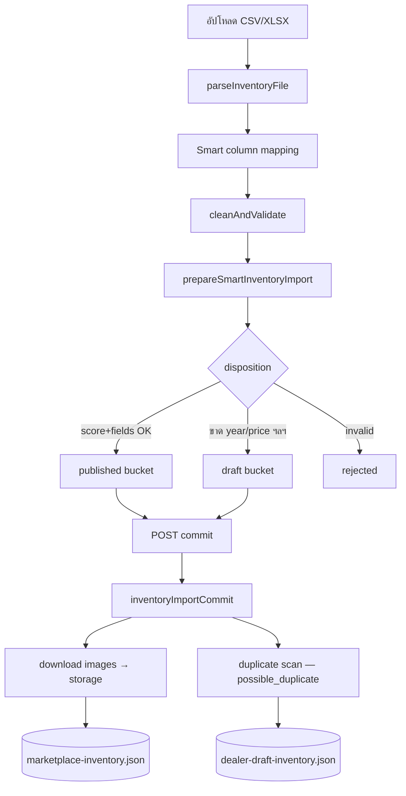
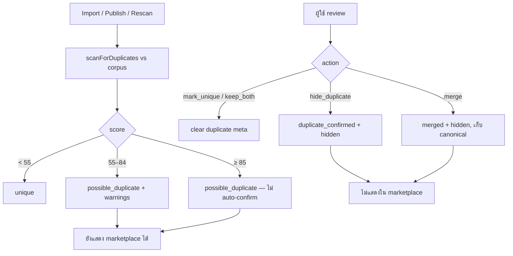

# Nong A — Version 4 Notes

Checkpoint: **Nong-A-Version-4** (Dealer Portal, Smart Import, Duplicate Detection, API Auth Stub)

เอกสารนี้สรุปสถาปัตยกรรมและวิธีใช้งาน ณ จุด freeze — ไม่มี feature ใหม่เพิ่มในไฟล์นี้

---

## Architecture ปัจจุบัน

```
┌─────────────────────────────────────────────────────────────────┐
│  Browser (React 19 + Vite + Zustand)                            │
│  Marketplace · Admin Import · Dealer Portal (/dealer/*)         │
└────────────────────────────┬────────────────────────────────────┘
                             │ fetch /api/*
                             ▼
┌─────────────────────────────────────────────────────────────────┐
│  Express (server.ts) — port 3000                                │
│  · dealerApiAuth  → /api/dealer/*                               │
│  · adminApiAuth   → /api/admin/*                                │
│  · Public         → GET /api/cars (published only)              │
└────────────────────────────┬────────────────────────────────────┘
                             │
         ┌───────────────────┼───────────────────┐
         ▼                   ▼                   ▼
  marketplaceInventory   dealerDraftInventory   dealerProfile
  (JSON + memory cache)  (JSON + memory cache)  (JSON)
         │                   │
         └─────────┬─────────┘
                   ▼
         inventoryImportCommit
         duplicateDetectionService
         listingImageStorage → data/listing-images/
```

**แนวคิดหลัก**

- **Single Node process** — `tsx server.ts` (dev) หรือ `node dist/server.cjs` (prod) ให้ทั้ง API และ Vite dev middleware
- **File-based persistence** — inventory / draft / profile เป็น JSON ใน `data/` (ไม่ใช่ DB ใน v4)
- **In-memory cache** — โหลด JSON ครั้งแรกแล้ว cache; การเขียนผ่าน API ใน process เดียวกันจะ sync — **restart dev server** หลังรัน test scripts ที่เขียนไฟล์โดยตรง
- **dealerId มาตรฐาน** — `thor-auto` (normalize จาก `dealer-thor-auto`, `owner-thor-auto`, …)
- **Marketplace** — แสดงเฉพาะรถ `published` + ไม่ `hidden` + ไม่ `sold` + ไม่ใช่ duplicate ที่ซ่อนแล้ว

---

## Modules สำคัญ

### Identity & access

| Path | บทบาท |
|------|--------|
| `src/utils/dealerIdentity.ts` | `THOR_AUTO_DEALER_ID`, `normalizeDealerId()`, owner context |
| `src/server/apiAuth.ts` | Bearer token guard (stub → Firebase later) |
| `src/server/dealerAccess.ts` | `X-Dealer-Id` scope, ownership checks |
| `src/utils/apiAuthHeaders.ts` | Client ส่ง `Authorization` + headers |

### Marketplace inventory

| Path | บทบาท |
|------|--------|
| `src/server/marketplaceInventory.ts` | CRUD, `getPublishedMarketplaceCars()`, visibility |
| `data/marketplace-inventory.json` | Source of truth — published/hidden cars |

### Draft inventory

| Path | บทบาท |
|------|--------|
| `src/server/dealerDraftInventory.ts` | Draft / needs_review records |
| `data/dealer-draft-inventory.json` | Source of truth — drafts |
| `src/server/publishDraftListing.ts` | Draft → marketplace + duplicate scan |

### Smart import pipeline

| Path | บทบาท |
|------|--------|
| `src/utils/inventoryImport/parseInventoryFile.ts` | CSV/XLSX parse |
| `src/utils/inventoryImport/smartFieldDetection.ts` | Column mapping |
| `src/utils/inventoryImport/cleaning/cleanAndValidate.ts` | Clean & validate |
| `src/utils/inventoryImport/importConfidence.ts` | Score + disposition |
| `src/utils/inventoryImport/import/prepareSmartImport.ts` | Published / Draft / Rejected buckets |
| `src/server/inventoryImportCommit.ts` | Commit + image download + duplicate scan on import |
| `src/server/listingImageStorage.ts` | ดาวน์โหลดรูป → `data/listing-images/` |

### Duplicate detection

| Path | บทบาท |
|------|--------|
| `src/utils/duplicateDetection/duplicateEngine.ts` | Score 0–100, marketplace hide rules |
| `src/utils/duplicateDetection/imageSignals.ts` | URL/filename/hash (พร้อม hook AI ภายหลัง) |
| `src/server/duplicateDetectionService.ts` | Corpus scan, import check, review actions |
| `src/server/duplicateRoutes.ts` | Admin duplicate APIs |

### Dealer Portal (UI)

| Path | บทบาท |
|------|--------|
| `src/components/dealer-portal/*` | Dashboard, inventory, drafts, import, profile, duplicates |
| `src/hooks/dealer/useDealerPortal.ts` | `dealerId`, API headers, import owner |
| `src/services/dealer/dealerApi.ts` | Dealer API client |

### Admin import (UI)

| Path | บทบาท |
|------|--------|
| `src/components/admin/inventory-import/InventoryImportView.tsx` | Upload → map → clean → review → commit |
| `src/components/admin/DealerDraftInventoryView.tsx` | Admin draft list + duplicate review |

---

## API สำคัญ

### Auth (Version 4 stub)

ทุก request ไป `/api/dealer/*` และ `/api/admin/*` ต้องมี:

```http
Authorization: Bearer <token>
```

| Role | Env (server) | Env (client / Vite) |
|------|----------------|---------------------|
| Dealer | `NONGA_DEALER_API_TOKEN` | `VITE_NONGA_DEALER_API_TOKEN` |
| Admin | `NONGA_ADMIN_API_TOKEN` | `VITE_NONGA_ADMIN_API_TOKEN` |

Dealer routes เพิ่ม:

```http
X-Dealer-Id: thor-auto
X-User-Role: dealer
```

ค่า dev default (ถ้าไม่ตั้ง env): `nonga-v4-dev-dealer-token` / `nonga-v4-dev-admin-token` — ดู `.env.example`

### Public marketplace

| Method | Path | คำอธิบาย |
|--------|------|----------|
| GET | `/api/cars` | รถที่แสดงในตลาดเท่านั้น (published, visible) |
| POST | `/api/cars` | สร้างรถ (legacy flow) |
| DELETE | `/api/cars/:id` | ลบรถ |

### Admin — import & drafts

| Method | Path | คำอธิบาย |
|--------|------|----------|
| POST | `/api/admin/inventory-import/commit` | Smart commit `{ published, drafts, owner }` |
| GET | `/api/admin/draft-inventory` | รายการ draft (`?dealerId=`) |
| PATCH | `/api/admin/draft-inventory/:id` | แก้ draft |
| POST | `/api/admin/draft-inventory/:id/publish` | Publish draft → marketplace |
| DELETE | `/api/admin/draft-inventory/:id` | ลบ draft |

### Admin — duplicates

| Method | Path | คำอธิบาย |
|--------|------|----------|
| GET | `/api/admin/duplicates` | กลุ่มรถซ้ำ + สรุป flagged |
| GET | `/api/admin/duplicates/:id` | รายละเอียด + scan |
| POST | `/api/admin/duplicates/:id/rescan` | สแกนใหม่ |
| POST | `/api/admin/duplicates/review` | `{ recordId, action, keepId?, hideId? }` |

### Dealer portal

| Method | Path | คำอธิบาย |
|--------|------|----------|
| GET | `/api/dealer/dashboard` | สรุป published / draft / duplicates |
| GET | `/api/dealer/inventory` | รถของเต็นท์ (`?q=`) |
| PATCH | `/api/dealer/inventory/:id` | แก้รถ |
| PATCH | `/api/dealer/inventory/:id/visibility` | ซ่อน/แสดง `{ hidden: boolean }` |
| DELETE | `/api/dealer/inventory/:id` | ลบรถ |
| GET | `/api/dealer/drafts` | Draft ของเต็นท์ |
| PATCH | `/api/dealer/drafts/:id` | แก้ draft |
| POST | `/api/dealer/drafts/:id/publish` | Publish เมื่อข้อมูลครบ |
| GET/PATCH | `/api/dealer/profile` | โปรไฟล์เต็นท์ |
| POST | `/api/dealer/import/commit` | Smart import (dealer scope) |
| GET | `/api/dealer/duplicates` | กลุ่มซ้ำของเต็นท์ |
| POST | `/api/dealer/duplicates/review` | Review actions |
| POST | `/api/dealer/duplicates/:id/rescan` | Rescan |

### SPA routes (client)

| Path | หน้า |
|------|------|
| `/dealer` | Dashboard |
| `/dealer/inventory` | Published inventory |
| `/dealer/drafts` | Draft / needs_review |
| `/dealer/import` | Smart import |
| `/dealer/profile` | Dealer profile |
| `/dealer/duplicates` | Duplicate review |
| `/admin/inventory-import` | Admin import (view ใน app) |

---

## Known limitations

1. **File JSON + memory cache** — ไม่เหมาะ multi-instance; restart หลังแก้ไฟล์นอก process
2. **Auth เป็น stub** — Bearer static token; ยังไม่ผูก Firebase ID token จริง
3. **Header spoof ถูกกันเฉพาะเมื่อมี token** — ต้อง rotate token ใน production
4. **ไม่มี DB transaction** — concurrent write อาจชนกัน
5. **Duplicate detection** — rule-based + image URL/hash; ไม่มี AI similarity จริง yet
6. **ไม่ auto-delete / auto-merge** duplicates — ต้อง review ด้วยมือ
7. **Import ซ้ำหลายรอบ** — สะสมรถใน JSON + flag `possible_duplicate` สูง
8. **รูปบาง URL ล้มเหลว** — fallback placeholder Unsplash
9. **GET /api/cars ไม่มี auth** — ตั้งใจให้ public marketplace
10. **Production** — ต้องตั้ง `NONGA_*_API_TOKEN` ใน env (ไม่ใช้ dev default)

---

## วิธี start dev

```bash
# 1) ติดตั้ง dependencies (ครั้งแรก)
npm install

# 2) คัดลอก env
cp .env.example .env
# แก้ GEMINI_API_KEY และ tokens ตามต้องการ

# 3) รัน dev server (API + Vite)
npm run dev
```

เปิดเบราว์เซอร์: **http://localhost:3000**

- Marketplace: หน้าแรก / marketplace view  
- Admin import: ตั้ง role admin → `/admin/inventory-import`  
- Dealer Portal: ตั้ง role dealer → `/dealer` (หรือลิงก์ Header)

**หลังรัน test scripts** ที่เขียน `data/*.json` โดยตรง → **restart `npm run dev`** เพื่อให้ API อ่านข้อมูลล่าสุด

---

## วิธี test

```bash
npm run lint
npm run test:smart-import      # Smart mapping + 4 pub + 1 draft
npm run test:dealer-portal     # Isolation + publish + hide
npm run test:duplicate-detection
npm run test:import-sample     # Thor CSV smart import E2E
npm run build
```

| Script | ตรวจอะไร |
|--------|----------|
| `test:smart-import` | `ThorAuto-sample-with-data.csv`, disposition, commit |
| `test:import-sample` | Smart import 4+1, storage paths, `thor-auto` dealerId |
| `test:dealer-portal` | `thor-auto` vs `other-dealer`, edit, hide, draft publish |
| `test:duplicate-detection` | VIN/image match, marketplace hide, review |

Sample CSV: `public/samples/ThorAuto-sample-with-data.csv`  
คู่มือ: `public/samples/dealer-import-guide.md`

---

## วิธี backup

### ขั้นต่ำ (แนะนำก่อน freeze / deploy)

```bash
# สร้างโฟลเดอร์ backup พร้อมวันที่
mkdir -p backup/v4-YYYYMMDD

# ข้อมูลหลัก
cp data/marketplace-inventory.json backup/v4-YYYYMMDD/
cp data/dealer-draft-inventory.json backup/v4-YYYYMMDD/
cp data/dealer-profiles.json backup/v4-YYYYMMDD/

# รูปรถ
cp -r data/listing-images backup/v4-YYYYMMDD/

# config (อย่าแชร์ secret สาธารณะ)
cp .env.example backup/v4-YYYYMMDD/
```

### เต็ม (รวม source + build)

- ทั้ง repo (ยกเว้น `node_modules`)
- หรือ zip: `data/`, `public/samples/`, `src/server/`, `dist/` (หลัง build)

### Git tag

```bash
git tag -l Nong-A-Version-4
# checkout: git checkout Nong-A-Version-4
```

Tag: **Nong-A-Version-4** (commit หลัง freeze v4)

---

## วิธี restore

1. **หยุด server** (`Ctrl+C` บน `npm run dev` / `npm start`)
2. **แทนที่ไฟล์** จาก backup กลับไปที่ `data/`:

   ```bash
   cp backup/v4-YYYYMMDD/marketplace-inventory.json data/
   cp backup/v4-YYYYMMDD/dealer-draft-inventory.json data/
   cp backup/v4-YYYYMMDD/dealer-profiles.json data/
   cp -r backup/v4-YYYYMMDD/listing-images data/
   ```

3. **ตรวจ JSON** ว่า parse ได้: `node -e "JSON.parse(require('fs').readFileSync('data/marketplace-inventory.json'))"`

4. **Start server ใหม่** — `npm run dev` (cache โหลดใหม่จากไฟล์)

5. **ยืนยัน** — `GET http://localhost:3000/api/cars` และ `/dealer` inventory ตรงกับ backup

> ถ้า restore แค่ inventory แต่ไม่ restore `listing-images` — path `/storage/listings/...` อาจ broken

---

## Flow: Import รถ (Smart Import)



**Disposition (สรุป)**

| สถานะ | ความหมาย |
|--------|----------|
| `published` | เข้า marketplace ทันที |
| `draft` / `needs_review` | อยู่ draft จนแก้ครบ + Publish |
| `rejected` | ไม่ commit |

**Owner context ตอน commit**

```json
{
  "dealerId": "thor-auto",
  "ownerId": "owner-thor-auto",
  "ownerName": "...",
  "ownerPhone": "...",
  "showroomName": "..."
}
```

**จุดเข้า UI**

- Admin: `InventoryImportView` → `POST /api/admin/inventory-import/commit`
- Dealer: `/dealer/import` → `POST /api/dealer/import/commit`

---

## Flow: Duplicate review



**Scoring signals (0–100)**

- VIN, ทะเบียน, เบอร์โทร, brand/model/year, mileage, price, รูป (URL/filename/hash), title/description similarity

**Review actions** (`POST .../duplicates/review`)

| action | ผล |
|--------|-----|
| `mark_unique` | ยืนยันไม่ซ้ำ — clear meta |
| `keep_both` | เก็บทั้งคู่ — clear meta |
| `hide_duplicate` | ซ่อนรายการ + `duplicate_confirmed` |
| `merge` | รายการรอง → `merged` + hidden, เก็บ `keepId` เป็น canonical |

**UI**

- Dealer: `/dealer/duplicates`
- Admin: ส่วนล่าง `DealerDraftInventoryView`
- หลัง import: `DuplicateImportWarnings` ใน confirmation

**กฎ marketplace**

- `duplicate_confirmed` / `merged` ที่ไม่ใช่ `duplicateCanonicalId` → **ไม่แสดง** ใน `GET /api/cars`
- `possible_duplicate` → **ยังแสดงได้** (มี warning ภายใน)

---

## Data files schema (สรุป)

### `MarketplaceCarRecord` (สำคัญ)

- `id`, `title`, `brand`, `model`, `year`, `price`, `images`, `dealerId`
- `listingStatus`: `published` | `hidden`
- `duplicateStatus`: `unique` | `possible_duplicate` | `duplicate_confirmed` | `merged`
- `duplicateGroupId`, `duplicateCanonicalId`, `duplicateMatches[]`

### `DealerDraftRecord` (สำคัญ)

- `id`, `dealerId`, `status`: `draft` | `needs_review`
- `missingFields`, `confidenceScore`, `normalizedData`
- duplicate fields เหมือน marketplace

---

## Production checklist (สั้นๆ)

- [ ] ตั้ง `NONGA_DEALER_API_TOKEN` / `NONGA_ADMIN_API_TOKEN` แบบสุ่มยาว
- [ ] ตั้ง `VITE_*` ให้ตรงกับ server
- [ ] `NODE_ENV=production` — ไม่ใช้ dev token default
- [ ] Backup `data/` เป็นระยะ
- [ ] พิจารณา Firebase Auth แทน stub
- [ ] ล้าง inventory ทดสอบก่อน go-live

---

*Generated for Nong A Version 4 freeze — อัปเดตเมื่อมีการเปลี่ยน architecture หลัง v4*
