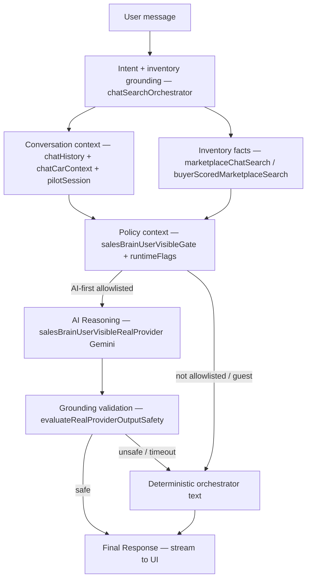

# Epic B — AI-First Consolidation / Single AI Conversation Path

**Status:** Implementation complete (staging/local allowlist) — **Owner-browser acceptance PENDING**  
**Branch:** `feature/chat-image-attachment-v1`  
**HEAD:** `9dbc255` (+ uncommitted Epic B changes)  
**Origin:** `https://github.com/jorradol/nonga.git`  
**Slice:** `epic-b-ai-first`

---

## 1. Before — Runtime Path Diagram (OLD)

```mermaid
flowchart TD
  UI[ChatContainer → useChat.sendMessage]
  Orch[tryOrchestrateChatReply — deterministic-first]
  Det[Templates: chatSearchReplyCopy / buyerCarPitchCopy / advisors]
  Bridge[applyChatUserVisibleServerBridge — signed-in only]
  MockPilot[salesBrainUserVisibleChatPath — mock template polish]
  RealProv[maybeApplyUserVisibleRealProvider — follow-up zones only]
  LegacyGemini[/api/gemini/chat-stream — unsigned path]
  MockFB[chatMockFallback]

  UI --> Orch
  Orch -->|skipGemini=true ~90% buyer intents| Det
  Orch -->|signed-in| Bridge
  Bridge --> MockPilot
  MockPilot --> RealProv
  RealProv -->|pilotPathActive + ownerControlledZone| Gemini[Real Gemini]
  Orch -->|null match| LegacyGemini
  LegacyGemini -->|fail| MockFB
  Det -->|local stream| UI
```

**Problem:** 3 parallel text-generation paths (deterministic templates, mock pilot, legacy Gemini) with real provider gated to narrow follow-up zones.

---

## 2. Architecture Inventory

| Component | Current Role | Runtime Used | Duplicate Of | Recommendation |
|-----------|-------------|--------------|--------------|----------------|
| `useChat.ts` | Client orchestration entry | **Yes** | — | **Keep** — route all signed-in buyer turns through bridge |
| `chatSearchOrchestrator.ts` | Intent + inventory grounding | **Yes** | — | **Keep** — grounding-only for AI-first; text = fallback |
| `chatUserVisibleOrchestrateClient.ts` | Auth bridge client | **Yes** | — | **Keep** — expose `realProviderNetwork` |
| `salesBrainServerUserVisibleOrchestrationBridge.ts` | Server orchestration | **Yes** | — | **Merge** — AI-first skips mock pilot |
| `salesBrainUserVisibleRealProvider.ts` | Real Gemini + guardrails | **Yes** (allowlist) | legacy `/api/gemini/*` | **Keep** — primary text generator |
| `salesBrainUserVisibleChatPath.ts` | Mock pilot template polish | **Yes** | chatSearchReplyCopy | **Retire from runtime** (AI-first) |
| `salesBrainUserVisiblePilotBuyerCopy.ts` | Pilot Thai templates | **Yes** | buyerCarPitchCopy | **Retire from runtime** (AI-first) |
| `chatSearchReplyCopy.ts` | Search/compare/selected copy | **Yes** | pilot buyer copy | **Fallback Only** |
| `buyerCarPitchCopy.ts` | Scored search pitch lines | **Yes** | pilot copy | **Fallback Only** |
| `chatRefinementReplyCopy.ts` | Refinement follow-up copy | **Yes** | real provider | **Fallback Only** |
| `chatBuyerAdvisorTemplates.ts` | Generic advisor topics | **Yes** | — | **Fallback Only** |
| `chatBuyerFactsQa.ts` | Grounded facts Q&A | **Yes** | — | **Fallback Only** (grounding reuse) |
| `chatBuyerFinanceCalculator.ts` | Finance calculator | **Yes** | — | **Fallback Only** |
| `buyerScoredMarketplaceSearch.ts` | Scored search + cards | **Yes** | marketplaceChatSearch | **Keep** — card grounding |
| `marketplaceChatSearch.ts` | Inventory search | **Yes** | — | **Keep** |
| `chatPilotSessionContext.ts` | Session card grounding | **Yes** | chatCarContext | **Keep** |
| `chatHistoryService.ts` | Firestore + local persistence | **Yes** | — | **Keep** |
| `chatStore.ts` | Zustand state | **Yes** | — | **Keep** |
| `aiService.streamChat` | Legacy Gemini stream | **Yes** (guest/unmatched) | real provider | **Fallback Only** |
| `chatMockFallback.ts` | Mock when Gemini down | **Yes** | — | **Fallback Only** |
| `salesBrainShadowChatPath.ts` | Shadow diagnostics | **Yes** (no UX change) | — | **Keep** (observability) |
| `salesBrainAdapter.ts` | Mock adapter contract | Admin/shadow | — | **Keep** (not buyer UX) |
| `salesBrainRealProvider.ts` | Real provider skeleton | Not buyer-wired | userVisibleRealProvider | **Merge** into user-visible path |
| `promptTemplates.js` | Legacy Gemini system prompt | Legacy stream | userVisible system instruction | **Fallback Only** |
| `salesBrainRuntimeFlags.ts` | Env flag resolver | **Yes** | — | **Keep** |
| `salesBrainUserVisibleGate.ts` | UID allowlist | **Yes** | — | **Keep** |
| `buyerAiFirstConversationPath.ts` | **NEW** Epic B coordinator | **Yes** | — | **Keep** |

---

## 3. NEW — Single AI Conversation Path



### Layer → Reused Component

| Layer | Component |
|-------|-----------|
| Intent | `tryOrchestrateChatReplyCore`, `parseBuyerSearchIntent`, `chatBuyerIntentGate` |
| Conversation Context | `chatHistoryService`, `chatPilotSessionContext`, `chatCarContext` |
| Inventory Facts | `marketplaceChatSearch`, `buyerScoredMarketplaceSearch`, `chatSearchFacts` |
| Policy Context | `salesBrainRuntimeFlags`, `salesBrainUserVisibleGate`, `buyerAiFirstConversationPath` |
| AI Reasoning | `salesBrainUserVisibleRealProvider.invokeUserVisibleRealProvider` |
| Grounding Validation | `evaluateRealProviderOutputSafety`, `hasCompareIdentityFailure` |
| Final Response | `useChat` stream + `chatStore` persistence |
| Fallback | `tryOrchestrateChatReply` deterministic text, `chatMockFallback` |

---

## 4. Implementation Summary

### Files changed

| File | Change |
|------|--------|
| `src/services/ai/buyerAiFirstConversationPath.ts` | **NEW** — eligibility + bridge invocation helpers |
| `src/services/ai/buyerAiFirstConversationPath.js` | **NEW** — server runtime companion |
| `src/services/ai/salesBrainUserVisibleRealProvider.ts` | AI-first bypasses `pilotPathActive` + `ownerControlledZone` gates |
| `src/services/ai/salesBrainServerUserVisibleOrchestrationBridge.ts` | Skip mock pilot when AI-first; grounding shell for null orchestrator |
| `src/services/ai/chat/chatUserVisibleOrchestrateClient.ts` | Expose `realProviderNetwork` to client |
| `src/hooks/chat/useChat.ts` | All signed-in buyer turns → server bridge; general chat included |
| `scripts/test-epic-b-ai-first-conversation-path.mts` | **NEW** offline guard tests |
| `package.json` | Add `test:epic-b-ai-first-conversation-path` |

### Why each change

1. **buyerAiFirstConversationPath** — single eligibility contract; avoids duplicating flag checks across client/server.
2. **Real provider gate expansion** — provider becomes default for all buyer intents when AI-first flags + allowlist pass.
3. **Skip mock pilot** — retires template-first polish from runtime for AI-first users (templates remain as fallback seed).
4. **useChat bridge expansion** — signed-in buyers always hit ONE server path (no signed-in divergence for allowlisted cohort).
5. **Client realProviderNetwork** — Owner can verify AI was actually used in browser diagnostics.

---

## 5. Retire / Keep / Delete-later

| Action | Components |
|--------|------------|
| **Kept** | orchestrator grounding, inventory search, history, guardrails, real provider |
| **Merged** | server bridge + real provider into single path |
| **Retired from runtime** (AI-first on) | `salesBrainUserVisibleChatPath` mock polish, `salesBrainUserVisiblePilotBuyerCopy` template generation |
| **Fallback only** | `chatSearchReplyCopy`, `buyerCarPitchCopy`, `chatRefinementReplyCopy`, advisor templates, legacy Gemini stream |
| **Delete later** (post Owner review) | Duplicate `.js` compile outputs if build pipeline unified; retired template paths after soak period |

---

## 6. Required Staging Env (allowlisted owner)

```bash
NONGA_AI_PROVIDER=gemini
NONGA_AI_MODE=high
NONGA_AI_FIRST_ENABLED=true
NONGA_AI_USER_VISIBLE_ENABLED=true
NONGA_AI_USER_VISIBLE_REAL_PROVIDER_ENABLED=true
NONGA_AI_OWNER_ONLY_CONTROLLED_UX_ENABLED=true
NONGA_AI_USER_VISIBLE_ALLOWLIST_UIDS=<owner-firebase-uid>
NONGA_AI_BUDGET_DAILY_LIMIT=5
NONGA_AI_BUDGET_MONTHLY_LIMIT=50
NONGA_AI_EMERGENCY_KILL_SWITCH=false
GEMINI_API_KEY=<mounted-secret>
```

---

## 7. Verification

### Offline (PASS)

```bash
npm run test:epic-b-ai-first-conversation-path
```

### Owner-browser checklist (PENDING)

1. Sign in with allowlisted UID on staging
2. Search: "หารถ SUV งบ 5 แสน" — answer should be AI-generated Thai (not template blocks)
3. Follow-up: "คันแรกเหมาะกับครอบครัวไหม" — uses session cards + AI reasoning
4. Compare: "เทียบคันที่ 1 กับ 2" — grounded years/prices from inventory
5. Open browser devtools → bridge response should show `realProviderNetwork: true`
6. Kill `GEMINI_API_KEY` or set `NONGA_AI_EMERGENCY_KILL_SWITCH=true` → deterministic fallback, no crash
7. Guest session → legacy path unchanged (deterministic / legacy Gemini)

---

## 8. Deploy / Commit / Push

| Step | Status |
|------|--------|
| Commit | **Not done** — awaiting Owner instruction |
| Push | **Not done** |
| Hosting deploy | **Not done** |
| Cloud Run revision | **Not done** |

---

## 9. Regression Status

- Hard constraints respected: no production/marketplace/lead/Firestore/DTO changes
- Offline Epic B guard tests: **PASS**
- Owner-browser AI conversation: **NOT VERIFIED** — cannot report PASS

---

## 10. Final Verdict

**CONDITIONAL IMPLEMENTATION COMPLETE** — architecture consolidated to single AI-first path for allowlisted signed-in buyers. Deterministic/template layers demoted to fallback. **Owner-browser acceptance required before PASS.**
